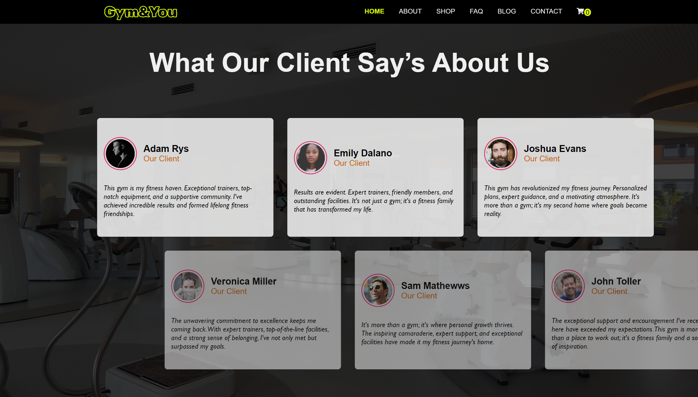
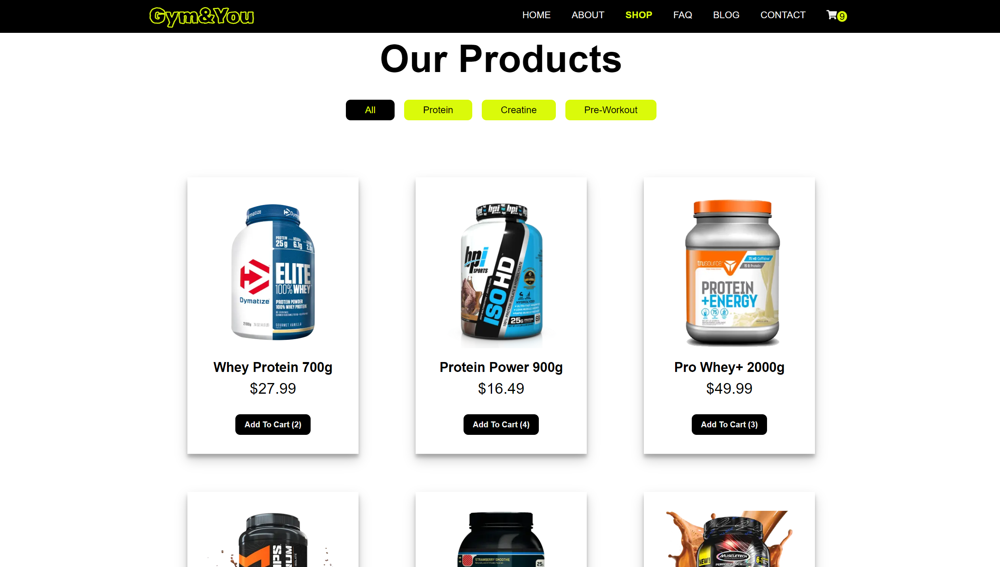
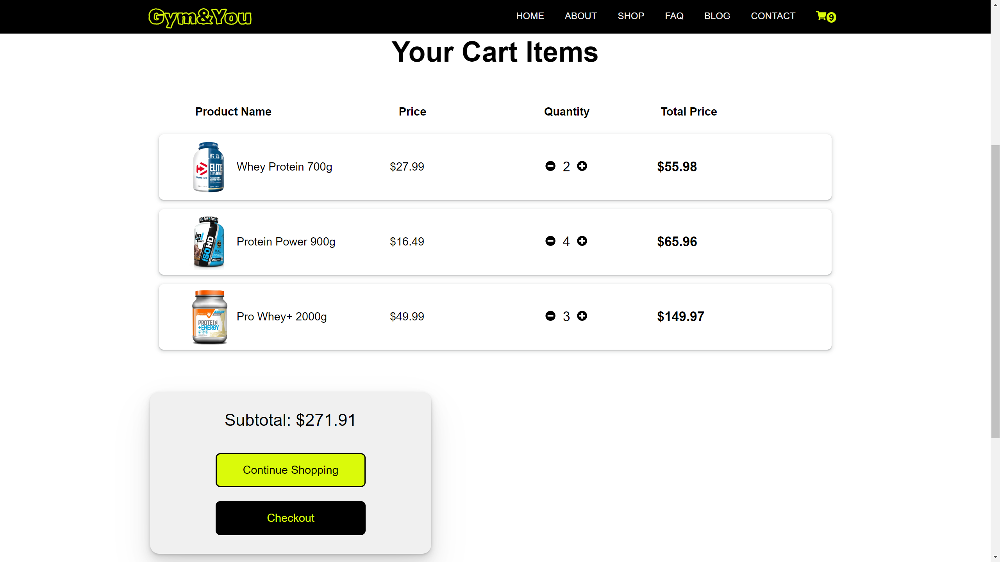

# Gym&You

## Screenshots

    </img>
     
    </img>
     
    </img>
     
    </img>

## Description

-   **Mobile, tablet and desktop view**
-   Website of a (hypothetical) Gym called "Gym&You"!
-   Website contains few subpages: About, Shop, FAQ, Blog, Contact and Cart.
-   Blog subpage contains Articles that user can click and go to the specific Article subpage.
-   Shop subpage contains Products List, with the option of adding to Cart selected Product.
-   Contact subpage contains a Form allowing the user to write message directly to the company, as well as contains information about adress, including map.

#### Technology used:

-   React
-   Next.js
-   SCSS
-   Framer Motion - Animations
-   E2E Tests
-   Properly functioning Back-End

## What I Learned

-   Using most important **SEO tags** in modern websites.
-   Mastering routing in Next.js
-   How to control state in contexts in bigger project using best practices. 
-   Using SCSS with react modules styles.
-   Creating advanced animations with library Framer Motion
-   Destructuring project to the smallest components.
-   Creating both E2E and Unit Tests.

## Author info

-   **Name:** Filip Bereszyński
-   **Age:** 22 years old
-   **Contact:**
    -   bereszynski.filip@gmail.com
    -   (+48) 510 240 074
